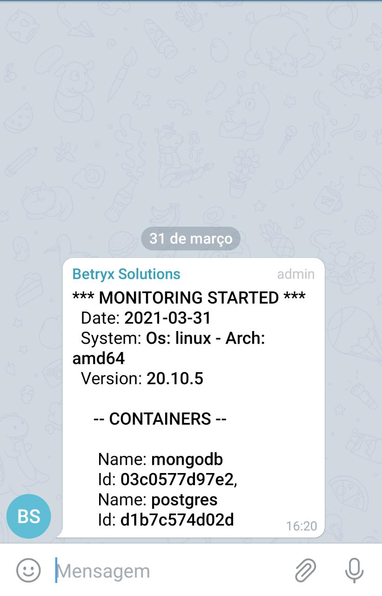
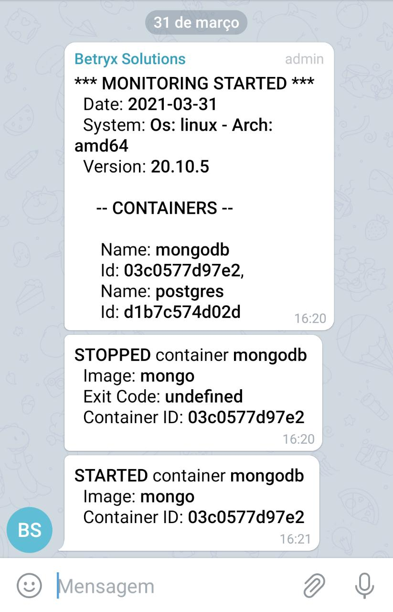

<h1 align="center">
   Notifier Container Docker
</h1>

<p align="center">
  <br>
  

  <a href="https://www.linkedin.com/in/khalleb/">
    
  </a>

  <a href="https://github.com/khalleb/ignews/commits/main">
    
  </a>

  
</p>


<p align="center">
  <a href="#dart-sobre">Sobre</a> &#xa0; | &#xa0;
  <a href="#gear-requisito">Requisito</a> &#xa0; | &#xa0;
  <a href="#hammer_and_wrench-configuração">Configuração</a> &#xa0; | &#xa0;
  <a href="#rocket-uso">Uso</a> &#xa0; | &#xa0;
  <a href="#framed_picture-imagens">Imagens</a> &#xa0; | &#xa0;
  <a href="#anchor-build">Build</a> &#xa0; &#xa0;
</p>

<br>

## :dart: Sobre ##
O projeto tem como intuito obter os status de containers do docker e notificar através do TELEGRAM.
## :gear: Requisito ##

- [Node](https://nodejs.org/en/) >= v12.20.1
- [Yarn](https://yarnpkg.com/lang/en/) >= v1.22.5


## :hammer_and_wrench: Configuração
Crie o arquivo [.env](https://github.com/khalleb/notifier-container-docker/blob/main/.env.example) e informe:
* `token`: Token de autorização do Telegram.
* `to`:  Identificador único para o chat.
Como gerar token: [Telegram Bot API](https://core.telegram.org/bots/api)
```env
  DRIVER_MESSAGE=telegram

  TELEGRAM_BOT_TOKEN=
  TELEGRAM_CHAT_ID=

  CONTAINER_FILTER=
```
Filtro para ignorar containers
```env
  CONTAINER_FILTER=!redis,!postgres
```
Filtro para containers
```env
  CONTAINER_FILTER=postgres,redis
```

## :rocket: Uso ##

```bash
# Clone this project
$ git clone https://github.com/khalleb/notifier-container-docker.git

# Access
$ cd notifier-container-docker

# Install dependencies
$ yarn install

# Build project
$ yarn build

# Run the project
$ yarn start
```

## :anchor: Build
 **Opcional**
Dando permissão ao arquivo
```bash
chmod +x build.sh
```
Execultando
```bash
/.build.sh
```
## :framed_picture: Imagens ##

<div>
    
    
</div>


